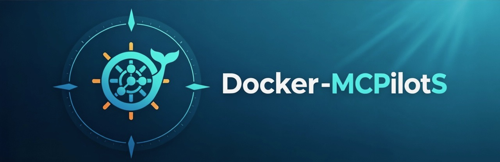

# 🐳 Docker-MCPilotS

> 🌐 English | [简体中文](README.md)

Give AI Agents hands to manage Docker (MCP Server) — works great with containers on Synology NAS, and runs on any machine with Docker installed.

## 🤔 Why This Project?

I use a Synology NAS daily, with dozens of Docker containers running on it: PT downloaders, media services, photo backups, code repos... Problems come up all the time — during deployments, upgrades, even during normal operation: containers won't start, permissions get messed up, networks stop working, resource usage spikes...

In the past, troubleshooting meant SSH'ing in and running commands. But NAS systems like Synology differ significantly from standard Linux servers — commands, paths, and permission systems are all customized. One wrong command could fail the operation at best, or brick the entire NAS at worst. Even worse, the NAS often runs critical services like photo backups and file sync — breaking it doesn't just take down a few containers, it takes down your whole home.

Or you could open Synology's clunky Docker UI and click around forever to find what you need.

Now that AI Agents have become so capable, I thought: **why not let AI help me manage these containers?** Let it troubleshoot issues, check logs, start/stop services — so I don't have to hold my breath every time something goes wrong.

But I couldn't just hand SSH access over to an Agent. NAS systems are too special, and the cost of a mistake is too high.

That's where MCP (Model Context Protocol) comes in - expose Docker management capabilities through the MCP interface, so the Agent can only perform operations we allow, with no risk to the system. It's essentially a **sandboxed Docker management tool**.

> 🤖 This project was built via **Vibe Coding** - the entire design, coding, and testing process was done in collaboration with AI, without a single line of hand-written code. If you're curious about this development approach, feel free to reach out.

## ✨ What Can It Do?

- 🖼️ **Web UI**: Graphical management interface, view and manage containers visually without AI
- 📦 Container Management: List, inspect, start, stop, restart, delete
- 📜 Container Logs: View logs with time-based filtering
- 📊 Container Resources: Real-time CPU, memory, network usage
- 🔍 Container Diagnostics: Process list, health status, network connections, mounted volumes
- 🌐 Network Topology: View all Docker networks and connected containers
- 💾 Volume Inventory: View all volumes and their mount points
- 🖥️ System Diagnostics: Host CPU, memory, disk, network info
- 🔐 Access Control: Three roles (admin, operator, observer), per-container permission scoping
- 📦 **Container Exec**: Secure `docker exec` tool, disabled by default, admin-only, with container scope restrictions

## 📖 How to Use?

1. Deploy this MCP Server on your NAS (see [Deployment Guide](docs/en/deployment-guide.md))
2. Add the MCP Server in your AI client (OpenClaw, Hermes, Trae, Cursor, Claude Code, Codex...) with the address and API Key
3. Start chatting, let the Agent manage your containers

**Typical scenarios:**

> "Help me check what's going on with the jellyfin container? Why didn't it come up?"

> "Show me CPU and memory usage for all containers"

> "Stop jellyfin, I need to upgrade it"

> "Show me jellyfin logs from the last 30 minutes"

> "Help me check the network configuration of the jellyfin container, what are the port mappings?"

## 🧰 Toolbox Container (Recommended for exec usage)

If you want to use the `exec_container` tool to run commands inside containers, we strongly recommend using a dedicated toolbox container instead of executing commands directly in your production containers.

See [Toolbox Container](docs/en/toolbox-container.md) for details.

## 📚 More Documentation

| Document | Description |
|----------|-------------|
| [Deployment Guide](docs/en/deployment-guide.md) | Three deployment methods, environment variables, config file overview |
| [Access Control](docs/en/access-control.md) | Role descriptions, container scope control, exec permissions |
| [Toolbox Container](docs/en/toolbox-container.md) | Why use it, usage steps, mount notes |
| [Web UI Guide](docs/en/web-ui-guide.md) | Page features, first login, status colors |

## ⚠️ Risk Warning

**By using this project, you understand and accept the following risks:**

1. Container operations have risks: stopping, deleting containers may cause data loss or service interruption
2. Permission configuration needs care: admin role has full access, keep API Keys safe
3. Intranet use only: default config only listens on localhost, do not expose directly to the internet
4. Use at your own risk: this project is provided as open source, users evaluate risk themselves
5. Back up your data: back up important data and configs, confirm before operations

## 📄 License

MIT License - see the [LICENSE](LICENSE) file for details.

## 🔗 Links

- 🐙 GitHub: https://github.com/sopyk/docker-mcpilots
- 🐛 Issues: https://github.com/sopyk/docker-mcpilots/issues
- 📦 Images:
  - Docker Hub: `sopyk/docker-mcpilots`
  - GHCR: `ghcr.io/sopyk/docker-mcpilots`
